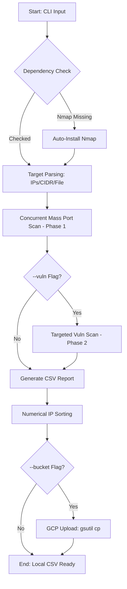

# Nmap Scanner Automation

A Python script for massive, asynchronous Nmap scans across multiple IPs and CIDR networks. It features automated CSV exporting, numerical IP sorting, and optional Google Cloud Storage (GCS) synchronization for production-grade stateless scanning.



## Key Features

- **Stateless & Resumable**: Automatically loads existing results from the CSV (local or cloud) to skip already completed IPs.
- **Graceful Termination**: Handles `SIGINT` (Ctrl+C) and `SIGTERM` (GCP shutdown scripts) by flushing data, sorting results, and uploading to the cloud before exiting.
- **Asynchronous Execution**: Leverages `asyncio` for high-performance concurrent scans.
- **Zero Configuration**: No external Python libraries required. Only standard library dependencies.
- **Automatic Dependency Resolution**: Automatically installs `nmap` if missing using the system's package manager (`apt`, `yum`, `dnf`, etc.).

## Requirements

- **OS Environment**: Linux-based systems.
- **Python 3.7+**: Uses `asyncio`, `argparse`, `csv`, `subprocess`, etc.
- **Root Privileges**: `sudo` is required for SYN Stealth scans and automatic package installation.
- **Google Cloud SDK (gsutil)**: Required only if using the `-b` flag for cloud synchronization.

## Usage

```bash
sudo python3 scan.py [ips ...] [-f FILE] [-b BUCKET] [--vuln]
```

### Arguments

- **`ips`**: (Positional) One or more IP addresses or CIDR networks (e.g., `8.8.8.8 192.168.1.0/24`).
- **`-f`, `--file FILE`**: (Optional) Text file containing a list of targets (IPs or CIDR). Duplicates are automatically filtered.
- **`-b`, `--bucket BUCKET`**: (Optional) GCS bucket name (e.g., `my-reports-bucket`). Reports are uploaded directly to the root of the bucket.
- **`--vuln`**: (Optional) Enables Two-Phase Vulnerability scanning using Nmap Scripting Engine (NSE) only on discovered open ports.

## Examples

**Direct IP Scan:**
```bash
sudo python3 scan.py 1.1.1.1 8.8.8.8 10.0.0.0/24
```

**File-based Scan:**
```bash
sudo python3 scan.py -f targets.txt
```

**GCP-Integrated Production Scan:**
```bash
sudo python3 scan.py -f targets.txt -b my-gcp-bucket --vuln
```

## Data Integrity & Resilience

The script is designed for cloud-native reliability:
1. **Thread-Safe Writing**: Results are appended to the CSV immediately upon completion.
2. **Post-Process Sorting**: Results are numerically sorted by IP address before finalization.
3. **Shutdown Resilience**: If interrupted, the script executes emergency cleanup procedures, ensuring the final report is sorted and synchronized with the cloud.

## Configuration (within `scan.py`)

- `MAX_PORT`: (Default: `10000`) Port range limit.
- `MAX_CONCURRENT_SCANS`: (Default: `30`) Maximum number of parallel Nmap processes.
- `LOG_FILE`: (Default: `scanner.log`) Operational log file.
